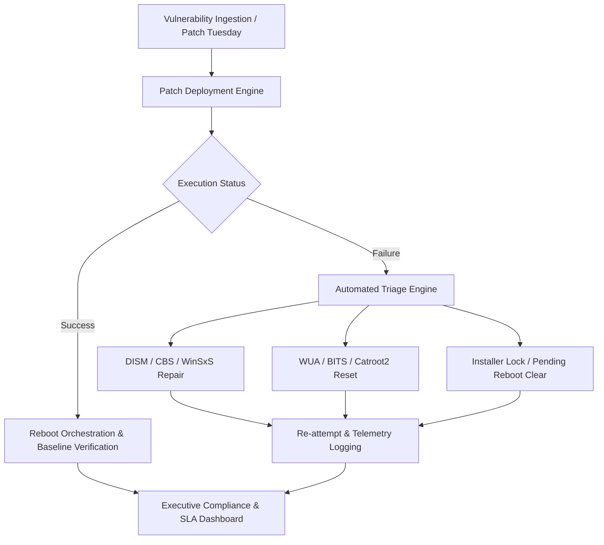

# Enterprise Windows Patch Management, Triage & Remediation Engineering Framework (without the AI)

[](LICENSE)
[](docs/01-architecture-and-decision-tree.md)
[](scripts/)

An enterprise-grade, backward-compatible automation and diagnostic framework for detecting, triaging, and automatically remediating failed Windows Updates (Cumulative, SSU, LCU, UUP) and 3rd-party application patches across legacy and modern fleets.

---

## Architecture Overview



---

## Repository Structure

```
windows-patch-management/
├── LICENSE                                     # MIT License
├── README.md                                   # Master Project Documentation
├── scripts/                                    # Production PowerShell Remediation Suite
│   ├── Invoke-WindowsPatchTriage.ps1           # Fleet-wide health & pending reboot triage
│   ├── Repair-WindowsUpdateAgent.ps1           # Complete WUA, BITS, cache teardown & rebuild
│   ├── Invoke-DismComponentRepair.ps1          # Staged DISM repair with offline WIM fallback
│   ├── Invoke-RemotePatchDiagnosticCollector.ps1# In-guest WinRM remote log & artifact bundle extractor
│   └── Install-ThirdPartyPackage.ps1           # Silent 3rd-party MSI/EXE deployment wrapper
└── docs/                                       # Deep-Dive Engineering Guides & Matrices
    ├── 01-architecture-and-decision-tree.md    # Fleet tiers, servicing engines, and triage paths
    ├── 02-legacy-servicing-guide.md            # Windows 7/8.1/Server 2008R2/2012 servicing
    ├── 03-modern-servicing-and-uup.md          # Windows 10/11/Server 2016-2025 UUP & USO
    ├── 04-cbs-dism-troubleshooting-matrix.md   # Error code matrix (0x800F081F, etc.) & locks
    ├── 05-third-party-packaging-matrix.md      # Silent switches for MSI, Inno, NSIS, InstallShield
    └── 06-executive-and-rca-reporting-templates.md # CISO 1-pagers & incident RCA templates
```

---

## Key Features

### 1. Fleet-Wide Operating System Support
* **Legacy Fleet**: Windows 7 SP1, Windows 8.1, Windows Server 2008 R2, 2012, 2012 R2.
* **Modern Fleet**: Windows 10, Windows 11, Windows Server 2016, 2019, 2022, 2025.
* **PowerShell Portability**: Strict compatibility ranging from legacy PowerShell 2.0/3.0 to PowerShell 5.1 and 7+ Core.

### 2. Comprehensive CBS & Component Store Diagnostics
* Covers critical servicing failure codes (`0x800F081F`, `0x80073712`, `0x80070002`, `0x8024200B`, `0x80070BC9`, `0x800705B9`, `0x8024402F`).
* Automated detection of rotated servicing logs (`CbsPersist_*.log` and `CbsPersist_*.cab`).
* Automated decoding of binary Windows Update ETL traces (`Get-WindowsUpdateLog`).

### 3. In-Guest Remote Diagnostic Collection
* Eliminates multi-port network fragmentation (SMB 445, DCOM/RPC 49152–65535, ICMP).
* Single-session WinRM execution creates a compressed triage bundle and returns it via SMB or in-stream bytes.

### 4. 3rd-Party Packaging & Deployment Watchdog
* Handles MSI mutex lock avoidance (Error `1618`), verbose logging (`/l*v`), process timeouts, and deferred reboot handling (Exit Code `3010`).

---

## Quick Start & Usage Examples

### 1. Run Local Patch Health Triage
```powershell
# Run local triage to inspect OS, pending reboots, WUA status, and disk space
.\scripts\Invoke-WindowsPatchTriage.ps1
```

### 2. Reset Corrupted Windows Update Agent
```powershell
# Stop services, clear SoftwareDistribution & catroot2, re-register DLLs, and run SFC
.\scripts\Repair-WindowsUpdateAgent.ps1

# Skip SFC for faster maintenance window execution
.\scripts\Repair-WindowsUpdateAgent.ps1 -SkipSfc
```

### 3. Repair Component Store Corruptions (WinSxS / DISM)
```powershell
# Automated online repair
.\scripts\Invoke-DismComponentRepair.ps1

# Source-aware repair pointing to an offline installation media WIM
.\scripts\Invoke-DismComponentRepair.ps1 -CustomWimPath "D:\sources\install.wim" -WimIndex 1
```

### 4. Collect Remote Diagnostic Bundle
```powershell
# Pull triage logs and state from a remote failing endpoint
.\scripts\Invoke-RemotePatchDiagnosticCollector.ps1 -TargetComputer "SRV-APP-01" -LocalDestinationRoot "C:\PatchDiagnostics"
```

### 5. Deploy Silent 3rd-Party Packages
```powershell
# Deploy an MSI package with mutex lock handling and verbose logging
.\scripts\Install-ThirdPartyPackage.ps1 -InstallerPath "C:\Installers\7z2408-x64.msi" -Arguments "/qn /norestart"
```

---

## Executive Governance & Compliance Reporting
Includes production reporting templates for CISO / executive board presentations and Technical Root Cause Analysis (RCA) post-mortems in [`docs/06-executive-and-rca-reporting-templates.md`](docs/06-executive-and-rca-reporting-templates.md).

---

## License
Released under the [MIT License](LICENSE).
