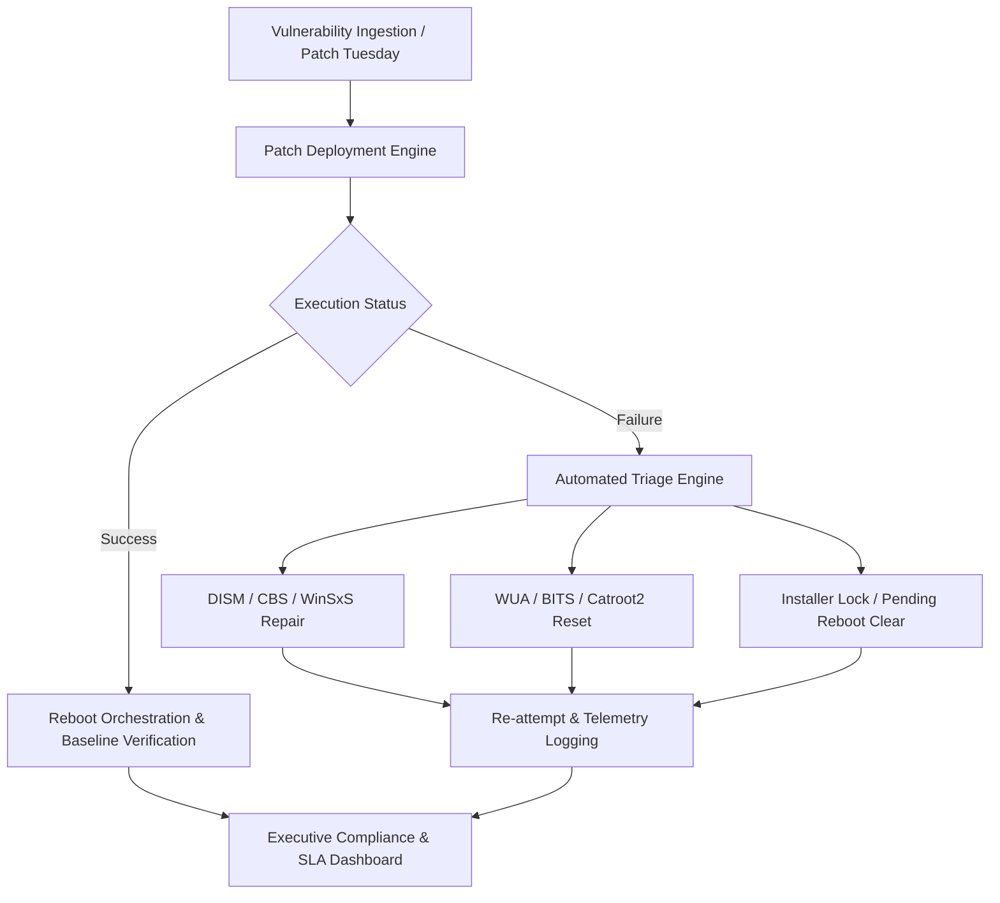

# Windows Patch Management Architecture & Remediation Decision Tree

## Enterprise Servicing Lifecycle

## Servicing Engine Tiers

| Architecture Tier | Target Operating Systems | Servicing Stack & Protocol | Scripting & Tooling Support |
| :--- | :--- | :--- | :--- |
| **Legacy Servicing** | Windows 7 SP1, 8.1, Server 2008 R2, 2012, 2012 R2 | WUA API v2 (`Microsoft.Update.Session`), `wusa.exe`, `pkgmgr.exe`, DISM v6.1 | PowerShell 2.0/3.0 syntax, WMI (`Win32_OperatingSystem`), CAB expansion |
| **Modern Servicing** | Windows 10, Windows 11, Server 2016–2025 | Unified Update Platform (UUP), Combined LCU+SSU, Hotpatching | PowerShell 5.1 / 7+ Core, CIM cmdlets, USO CLI (`usoclient.exe`), Delivery Optimization |
| **3rd-Party Packaging** | All Windows Versions | MSI (`msiexec`), WiX, NSIS, InnoSetup, InstallShield, Winget | Process mutex watchdog, exit code 3010 translation, verbose `/l*v` logging |

## Triage & Remediation Escalation Path

1. **Stage 1 — Connectivity & Pre-Flight Probe**: Rapid TCP handshake check (5985/445) via .NET sockets.
2. **Stage 2 — In-Guest Diagnostic Collection**: Pull `CBS.log`, `CbsPersist_*.log`, `DISM.log`, decoded `WindowsUpdate.log`, and MSI logs into an isolated temp archive.
3. **Stage 3 — Pending Lock & Reboot Evaluation**: Inspect the 6 critical registry flags across CBS, WindowsUpdate, and Session Manager.
4. **Stage 4 — Targeted Surgical Remediation**:
   - For cache/agent corruption (`0x80070002`, `0x8024402F`): Run `Repair-WindowsUpdateAgent.ps1`.
   - For component store missing payloads (`0x800F081F`, `0x80073712`): Run `Invoke-DismComponentRepair.ps1` with fallback WIM source.
5. **Stage 5 — Verification & Executive Reporting**: Re-evaluate telemetry and publish SLA status.
